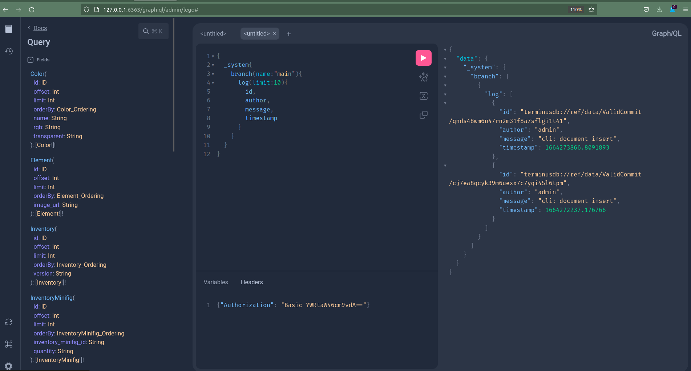

# How to implement GraphQL in fourteen days

My vision of TerminusDB has, since inception, been that it should be a
flexible content platform. That's why we've tried to develop not only
schema modelling capabilities but also git-for-data features, diff
calculators and automatically generated user interfaces.

Given our focus on content management and delivery, it might seem
strange then that it took us so long to start trying to position
TerminusDB as an ideal platform for headless CMSes. It took our
community prodding us into it, but we're taking the plunge.

To be a content platform it helps if you can plug in to existing data
ecosystems. And this has been a point of friction for TerminusDB.

And that's why we decided to go ahead and implement GraphQL for
TerminusDB. We (mostly Matthijs van Otterdijk with some help from
myself) implemented automatic schema construction from TerminusDB
schemata and the associated Query engine in a little over a week.

I'm extremely excited about this development, since it means that now
TerminusDB will be available to many more languages (anything with a
GraphQL client), there will be a high quality open-source method of
developing with GraphQL, and a straightforward method of exposing RDF
as a GraphQL endpoint.

It feels like a lot of unnecessary frictions simply fall away, and
TerminusDB seems to fit so naturally into the GraphQL environment that
I'm confident it will quickly be one of the best platforms around for
serving content via GraphQL.

## Juniper

We didn't do it from scratch of course, we leveraged the already
existing, and very well designed (if not so brilliantly documented)
[Juniper](https://github.com/graphql-rust/juniper).

Juniper is really great and we can recommend it, but be wary of the
[Junpier
book](https://graphql-rust.github.io/juniper/master/quickstart.html). It
is pretty badly out of date. You're better off reading the code
examples and automatically generated rust docs.

This toolkit lets you develop GraphQL endpoints directly from your
rust datastructures when you have a static schema, or to generate a
dynamic schema yourself.

We used both approaches to expose different parts of TerminusDB.

## Static - Exposing TerminusDB's innards

The internal aspects of TerminusDB, the system database (`_system`),
the repository graph (`_meta`) and the commit graph (`_commits`) are
all available to explore using the GraphQL endpoint. This makes
various administrative tasks simpler, and the powerful introspection
tools that GraphQL provides, makes exploring this fairly straightfoward.

You can point any graphql client at a valid TerminusDB data product
and you'll get access, not only to the data product, but this meta
data as well. For instance, you can look at the log of updates to the
database, or explore which branches exist.



## Dynamic - Modelling TerminusDB Documents in GraphQL

TerminusDB is build around the concept of a document.  In order to
expose this to GraphQL, we automatically create a number of *Object
type definitions* and *input Object type definitions* which enable the
GraphQL user to explore content in a TerminusDB and filter and order
it without any additional work.

The basic idea is that each TerminusDB document type yields an object
type, which has all the fields of the document type as retrieval
operations. If a field points at another document type, this operation
allows the retrieval of additiona linked documents, optionally
filtering and ordering on any of its properties. Each document type
also yields an operation in the top-level query object that similarly
allows filtering and ordering.

Using the [Star Wars Schema](../assets/star-wars.json) schema, with
the [Star Wars Turtle](../assets/star-wars-terminusdb.ttl) loaded, we
can perform a query which searches all star ships, for the one called
"Millenium Falcon", and then obtain the name of its pilot.

```graphql
{
  Starship(label: "Millennium Falcon"){
    label,
    pilot{
      label
    }
  }
}
```

To which we will get an answer such as the following:


Juniper made adding these queries automatically from the schema
dynamically fairly straightfoward. We simply traverse TerminusDB's
schema and create acceptable Juniper GraphQL objects as a result.

In order to perform searches, We also use Juniper's resolution with
little modification. We implemented parameters for these queries by
directly connecting to TerminusDB's storage backend and created
appropriate iterators in rust. The whole thing is pretty responsive
and surprisingly robust for a couple of weeks of work!

## The Future

We will be extending the GraphQL interface with additional features as
we go forward. We see this as the primary method of interaction for
many front-end applications which use TerminusDB so we want to make it
completely painless.

First we will extend the parameters for queries with a more elaborate
filtering system. We want to be able to filter your documents on the
properties of the documents which are linked to it as easily as the
top-level document.

Adding an intermediate [pagination and
-cursor](https://graphql.org/learn/pagination/)) object type is also
on our list. This will let us return cursors as well as metadata about
queries, such as the number of total results.

We also want to implement *back links* which will show you all things
that *link to* a given object, and not just what an object links to.

We would also like to introduce path queries directly to GraphQL. This
would let you specify a path expression which links you from the
current object, to any other object of interest. This will let you do
shortest path type operations, or ordered path operations. This would
really make GraphQL much more *graphy*.

Finally, we would like to be able to specify TerminusDB schemata in
GraphQL's schema language. Since GraphQL's class system is strictly
simpler, we can embed a GraphQL schema in TerminusDB without loss of
information.

We're interested in people playing around with this system and we're
very interested in feed back and suggestions.

To the Stars and Beyond!


