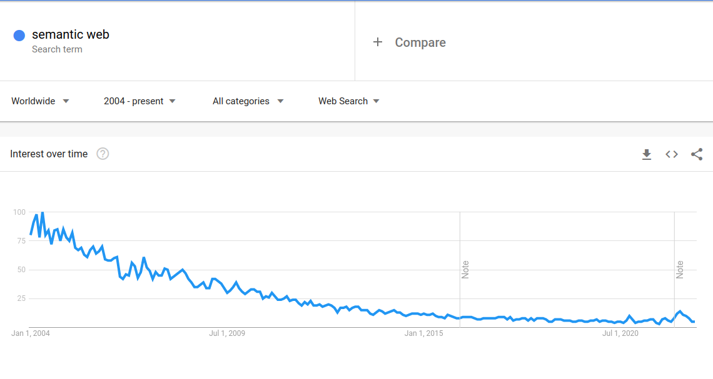

# The Semantic Web is Dead - Long Live the Semantic Web!

[The Semantic Web](https://en.wikipedia.org/wiki/Semantic_Web) is
rarely mentioned these days, so seldom that the declaration of its
death could be met by most of a younger generation of programmers with
a question: "The Semantic Who?"



This change in status is significant, but in some ways the Semantic
Web was on life-support since inception, and it continued to survive
only with the medical intervention of academic departments who had no
need to produce useable software or solve serious industry needs.

That's not to say that Semantic Web technologies *never* served any
industry needs. They certainly did so, but their penetration was
limited. And this limited penetration was not only the result of
ignorance on the part of data architects or software engineers. It was
also the fault of deep problems with the ideas in the
Semantic Web itself.

## Why the Semantic Web is a Great Idea

The Semantic Web's demise is a tragedy, because we need the Semantic
Web. But as with all things in life, one must adapt or die, and the
adaptations of the Semantic Web were late, ill advised, and did not
address the core problems which led it to be the wrong approach in the
first place.

Why do we need the Semantic Web?

Because distributed, interoperable, well defined data is literally the
most *central* problem for the current and near future human
economy. Knowledge is power, and distributable, actionable knowledge,
creates opportunities and efficiencies impossible with out it.

We need this. And we do not have this. Yet.

The Semantic Web set out ambitiously to solve this problem, but the
problem remains. My experience in engineering is that you almost
always get things wrong the first time, then you take that experience
forward and fix the core problems. Eventually you might get something
that really sticks.

The analogy of the World Wide Web here is also deeply suggestive of
what *might* be possible.  We have an incredible world wide system of
document storage and retrieval, the World Wide Web. These documents are
intended to be presented and (since Web 2.0) interacted with. But the
problem of getting machines to talk to eachother about the most basic
records in a sensible way is still open.

The Semantic Web was going to fix this. We would have not only
structured documents, but structured data. We would be able to
describe not only records, but the *meaning* of records. The records
would allow machines, which could be given access to *meaning* to
infer consequences from the data. We were going to have a rich distributed
data environment that would get richer with contributions from people
all over the world.

It would be like Wikipedia, but even more all encompassing, and far
more transformational. The effect of the Weather in Ireland on cow
prices, would be directly accessible and live, and could be
used to compute the likely costs of a steak at the super market. Live
feeds of wind data could be accessed to provide continental balancing
operations for the grid.

In short, the information age needs an information super-highway and
not just a big pipe for interactive documents.

## Key Innovations

The core ideas and aims of the Semantic Web were largely correct.

We should use a very flexible data structure, and a graph is very
flexible. Every data model which is not computation can fit in a
graph, and abstract syntax trees can easily represent intended
computations.

The ability to reference data resources means that we need large
unambiguous identifiers. URIs are able to solve this problem (though
there is still much ambiguity about the *meaning* of the URI and its
relationship to dereferencing).

We need a rich language to describe what the content *is* and what it
means. Communicating information about our information is as important
as the information itself.

## Where it all went wrong

But from here on out, the Semantic Web begins to make some serious
errors that basically made it impossible to gain wide-spread
acceptance. And while things are improving inside of Semantic Web
silos, interest is still waning.

### The Format

The first problem is really one that is hard to see without 20/20
hindsight. Triples can be used to describe a labelled graph. That is,
we can have three parts, S, P, and O and use this to denote the
origin, labelled edge, and target respectively as is done with
[N-Triples](https://www.w3.org/TR/n-triples/). It might look something like:

```n-triples
<http://example.com/a> <http://example.com#p> <http://example.com/b>
<http://example.com/a> <http://example.com#name> "a"^^<http://www.w3.org/2001/XMLSchema#string>
<http://example.com/b> <http://example.com#q> <http://example.com/a>
<http://example.com/b http://example.com#name> "b"^^<http://www.w3.org/2001/XMLSchema#string>
```

This is great because we are representing our graph with long names,
presumably within a context where *our* definitions are under our
control. This is important if we want a large world of
distributed data. We even have some terminals in our graph with *data*
which can allow us to representing typical datatypes which we do not
want to weave out of the graph individually (Peano arithemetic would
be a bit much).

And if we're lucky, we can make it possible to disclose information
about the meaning by attempts to *dereference* them using the given
protocol. Very meta.

This graph above represents a simple loop, but as we can see, is a bit
hard for a human to read. We can fix this by defining some prefixes
`ex:` to mean `http://example.org/stuff/` and `exs:` to mean
`http://example.com/stuff/schema#` and `xsd:` to mean
`http://www.w3.org/2001/XMLSchema#`.

```turtle
ex:a exs:p ex:b .
ex:a exs:name "a"^^xsd:string .
ex:b exs:q ex:a .
ex:b exs:name "b"^^xsd:string .
```

That's certainly a bit better. However, redundancy is not our friend
here. It's easier again to read using the Turtle format, which allows
us to refer to prior lines of information as a short hand. This is good
for human readability, but also for computers, which have to read less
information (which becomes an issue when graphs are huge).

```turtle
@prefix xsd: <http://www.w3.org/2001/XMLSchema#> .
@prefix ex: <http://example.org/stuff/> .
@prefix exs: <http://example.org/stuff/schema#> .

ex:a exs:p ex:b ;
     exs:name "a"^^xsd:string .
ex:b exs:q ex:a ;
     exs:name "b"^^xsd:string .
```

So far so good. We now have a way
([Turtle](https://www.w3.org/TR/turtle/)) to represent graphs which
can be communicated. Unfortunately few programming tools have any way
of reading this into an easily manipulable data object. XML was a
contender, and XML indeed can represent these graphs in an alternative
syntax. But XML, despite vastly larger uptake by industry, is falling
into disuse itself because it is verbose, hard to read, and similarly
hard to manipulate.

While all of this was taking place,
[JSON](https://www.json.org/json-en.html) was becaming the defacto
data interchange standard. Many in the Semantic Web community scoff at
JSON and vocally claim it is a mistake. But Vox populi vox Dei.

JSON and the related [YAML](https://yaml.org/) are among the best data
interchange formats. They are fairly easily read by humans, they map
directly to vastly popular data structures which are ubiquitious now in
programming languages (the associative array) and are extremely well
supported for lookup, iteration, pretty printing, and update.

XML by contrast is awful to look at. And neither is it very fun to
process XML documents while using a programming language (although
[prolog](https://www.swi-prolog.org/pldoc/man?predicate=xpath/3)
actually fits pretty naturally on XML as a query language).

In an alternative world were Lisp won before the AI winter, we might
have ended up with
[S-Expressions](https://en.wikipedia.org/wiki/S-expression), but even
these are probably worse as they do not make naming of the keys
mandatory (as opposed to by-position arguments), leading to less
readability without having more context.

I'm absolutely positive that some people reading this are going to
complain that syntax is just syntax, how things are serialised is
superfluous and that a good library can make it easy to use INSERT MY
THING HERE. But these people are wrong and their opinions will drift
into obscurity the same way that Turtle and XML will. Naming is deeply
important, it is no mere triviality; so how much more important is
sentence structure?

Of course there is [JSON-LD](https://json-ld.org/). This was a very
serious attempt to bring Linked Data into the JSON developments, and
should be applauded. It is however, needlessly verbose as an
interchange format. I'll explain more later.

JSON, and relatives are still expanding in use and will continue to do
so. The Semantic Web of the Future must embrace this fact.

### The Logic

There are many different and overlapping standards which define
Semantic Web technologies, but I think we can focus on
[OWL](https://en.wikipedia.org/wiki/Web_Ontology_Language) which
represents one of the most serious attempts to create a formal basis
for the description of data.

The idea of representing the structure of data in a data structure
that is the same as the data is of course not a new idea (Think S-Exp)
but it is a good one. And OWL took this up. OWL is defined to use the
same kind of turtle format as above.

The problem with OWL is that it solved a problem, but not one that
anyone wanted solved. It also did it in a very hard to use way. So
hard to use that almost nobody has successfully used it. I've tried.
And I've written many machine checked proofs in everything ranging
from [Atelier B](https://www.atelierb.eu/en/atelier-b-tools/), through
[FDR4](https://cocotec.io/fdr/) to [Agda](https://github.com/agda/agda)
and [Coq](https://coq.inria.fr/).

Maybe I'm not the sharpest knife in the drawer, but I've written
significant proofs in these diverse languages, and never experienced
the same pain as with OWL.

What is OWL *supposed* to do. It's supposed to be an
[Ontology](https://en.wikipedia.org/wiki/Ontology) language. That is,
a language that helps us reasons about the categories of things, and
how they inter-relate. It is closely related to [Description
Logics](https://en.wikipedia.org/wiki/Description_logic) used in
several specialised areas in which the codification is both complex
and very important such as biomedical knowledge.

It however makes some fatal errors that impede its use.

Types are easier for programmers to work with than these logical
languages. Types are important, not just in low level and compiled
languages, but increasingly in dynamic languages such as python and
javascript. Speed is just one benefit of telling the computer what you
mean. Another benefit is that the computer can tell you if what you
mean is garbage.

And this is why OWL is such a bear. It is very easy to tell OWL you
mean something and it just believes you. It provides very little
support to the data architect in making sure that things make sense.

For instance, in a programming language, if I define a class A as a
subclass of class B, and then define a class B as a subclass of class
A, it will most likely complain. In OWL it will just equate class A
with class B.

This sort of equivocation by circularity is virtually *never* what one
means. Yet I found numerous examples of these cycles in wild
OWL. Nobody noticed them because OWL really had no problem with them,
and it is not unless you actually check what inferences arise that you
can see the problem.

And this is not unusual. One of the formalisers of OWL said this:


The logical approach simply gives the practitioner too much rope to
hang themselves, with very little feedback. An advanced researcher can
discover these logical conundra but it is too much mental burden for
every day use.

What caused this problem to arise, and what do we do about it?

### Lets make everything *potentially* the same

First, not having a [Unique name
assumption](https://en.wikipedia.org/wiki/Unique_name_assumption) is a
mistake. Plain and simple. This is the idea that any two URIs might
actually mean the same thing unless we explicitly say otherwise. This
is a terrible idea for computers in much the same way as it is for
humans attempting knowledge representation.

If you want something to be the same you should be forced to say
it. Aliasing is a nightmare, computationally expensive and leads to
difficult to understand reasoning.

The second mistake serious mistake is the Open World Assumption, the
converse of the [Closed World
Assumption](https://en.wikipedia.org/wiki/Closed-world_assumption). This
assumes that there is as yet ungathered data, forcing us to reason
only about what we have at the minute. This might sound like a clever
proposal but in practice makes reasoning weak.

Basic things like checking that we have exactly one name for someone
become stupidly complicated with the overlap of the above two
rules. OWL would rather make two people the same, then complain that
you've done something wrong.

### Things are too Far Apart

It may seem banal and "just syntax", but when writing large
Ontologies, OWL makes you wander far from home when trying to define
the meaning of a class. The class requires lots of separately defined
properties, each of which is verbose. When you add restrictions to them
it becomes even worse: you have to add yet another class that you then
intersect with your class to ensure the restriction.

```turtle
system:Capability
  a owl:Class ;
  rdfs:subClassOf system:Document, system:CapabilityScopeRestriction ;
  rdfs:label "Capability"@en ;
  rdfs:comment "A capability confers access to a database or server action"@en .

system:capability
  a owl:ObjectProperty ;
  rdfs:label "capability"@en ;
  rdfs:comment "associates a role with its capabilities"@en ;
  rdfs:domain system:Role ;
  rdfs:range system:Capability .

system:capability_scope
  a owl:ObjectProperty ;
  rdfs:label "Capability Scope"@en ;
  rdfs:comment "The scope of a capability - the resource that the capability applies to"@en ;
  rdfs:domain system:Capability ;
  rdfs:range system:Resource .
```

This may be expressive but extremely annoying and time consuming. In
practice I've seen people completely skip ontologising because the
pain barrier was so high specifically for this reason. Making routine
tasks time consuming is a great way to ensure they don't happen.

### Polluting the Data with Inference

While you can use OWL to talk about your data model, you can also use
it to enrich your data from the model. This sounds brilliant because
we often want calculated information. However, in practice this is
never so nice as a [view](https://en.wikipedia.org/wiki/View_(SQL)) is
in SQL. Why?

The reason is that with a view you create a new distinct resource
which is calculated. With clever technology you can update the data
and get a new view updated automatically. Some advanced databases even
have ways to insert into a view to update the original tables.

In OWL we entail things into the graph which then look just like the
data from which it was entailed. This makes life complicated when
trying to distinguish from information you got from the real world,
and information that you got from some chain of reasoning.

And chains of reasoning can be very fraught, pollute the database. In
practice I often found that things were performed as a batch load
process to avoid the problem by restarting with new data. This is of
course a ridiculous way to work with a large database.

The dream of computers which reasoned about data as it arrived to
create some great symbolic AI, without a
[Doxastic](https://en.wikipedia.org/wiki/Doxastic_logic) approach is
frankly silly.

### Not much in the way of useable constraints, sorry

And we can't use OWL to provide effective constraints over data. Open
World precludes this. We can sometimes say when things are wrong, but
we are never sure if things are right. We might always have one more
element of a cardinality check that we just don't know yet.

People who really wanted to use the Semantic Web in industry got
fairly fed up with this difficulty and writing individual programmatic
checkers and SPARQL queries to patch up the deficiency and eventually
invented [SHACL](https://www.w3.org/TR/shacl/).

SHACL goes a long way to alleviating this problem with OWL, but then
it doesn't replace OWL. Instead of giving us a schematic ontology
language, we are left with two different languages which must now be
kept in sync. Or we ditch the more descriptive partner, OWL and just
use SHACL and move RDF data closer to what is already done in SQL.

This can work, and is an improvement to the data stack, but it also
loses some of the main appeal of the Semantic Web vision of highly
documented metadata about data.

### The Right Way (TM) is Right In Front Of Us

Instead of all of this complexity, we should just have a standard
schema language, which can be written in JSON or YAML. It should allow
us to describe all of the data model in human language. It should make
it easy for this to be internationalised.

We could even specify what is derived here *explicitly* separating
constraint from inference. And we should keep derived data segregated
from other data so we know the provinence as long as we ensure that
properties can not be either derived or concrete with the user being
unable to distinguish.

Already most of those using JSON in anger in industry are focusing on
[JSON Schema](https://json-schema.org/). This solves the easy problems
for trees, but not the problems for graphs. It also doesn't solve the
problem of describing the meaning of data, or give any help with
inference or calculation.

What we need is a
[Literate](https://en.wikipedia.org/wiki/Literate_programming) Type
Theory for JSON, which allows us to specify typed references, giving
us the power of graphs, but the simplicity of JSON at the same time.

We should keep the ideas of URIs because without them we will have a
very hard time making interoperable data.

But JSON-LD is more heavy weight than necessary. If we have
information about our data, then we can know if something is a string
or a reference or a collection and what type of collection. We
needen't use something as elaborate as JSON-LD other than perhaps as
an [elaboration](https://leodemoura.github.io/files/elaboration.pdf).

> The good thing about standards is that there are so many to choose from.
— Andrew S. Tanenbaum

I've been working to try out some of these ideas at [TerminusDB](https://github.com/terminusdb/terminusdb) (stars welcome), but for this to work it needs
to be a standard which is widely shared. And for that reason we need a
standard. We need a movement to revitalise the Semantic Web with
*ideas* that primarily serve to *do work*.

Luckily, there is renewed interest in Semantic Web-like ideas in
industry, but industry is not looking to the Semantic Web or to
academia to solve them. It's looking to find them in the ideas of the
[Data Mesh](https://www.datamesh-architecture.com/).

## Academics and Industry

The political economy of academia and its interaction with industry is
the origin of our current lack of a functional Semantic
Web.

Academia is structured in a way that there is very little
incentive for anyone to build usable software. Instead you are
elevated for rapidly throwing together an idea, a tiny proof of
concept, and to iterate on microscopic variations of this thing to
produce as many papers as possible.

In engineering the devil is in the detail. You really need to get into
the weeds before you can know what the right thing to do is. This is
simultaneously a devastating situation for industry and
academia. Nobody is going to wait around for a team of engineers to
finish building a system to write about it in Academia. You'll be
passed immediately by legions of paper pushers. And in industry, you
can't just be mucking about with a system that you might have to throw
away.

We have structured collaboration as the worst of both
worlds. Academics drop in random ideas, and industry try them, find
them useless, and move on.

I'm not sure precisely of the right solution to this problem, but I
think it genuinely has to change. Innovation in industry is rare and
hard since deep tech is so high risk. And innovation in academia is as
likely to be pie in the sky as the next big thing, because nobody has
the capacity to work through the differences between the two.

## The Future of the Semantic Web

The Future of the Semantic Web is there, the Semantic Web will rise,
but it will not be the Semantic Web of the past. Humanity's access to
data is of ever increasing importance, and the ability to make
resilient and distributed methods of curating, updating and utilising
this information is key. The ideas which drove the creation of the
Semantic Web are nowhere near obsolete, even if the toolchain and
technologies which have defined it up to day are fated to go the way
of the dinosaur.
