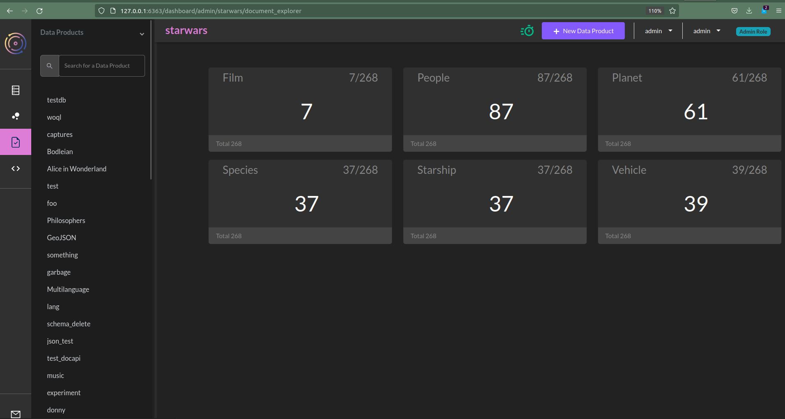
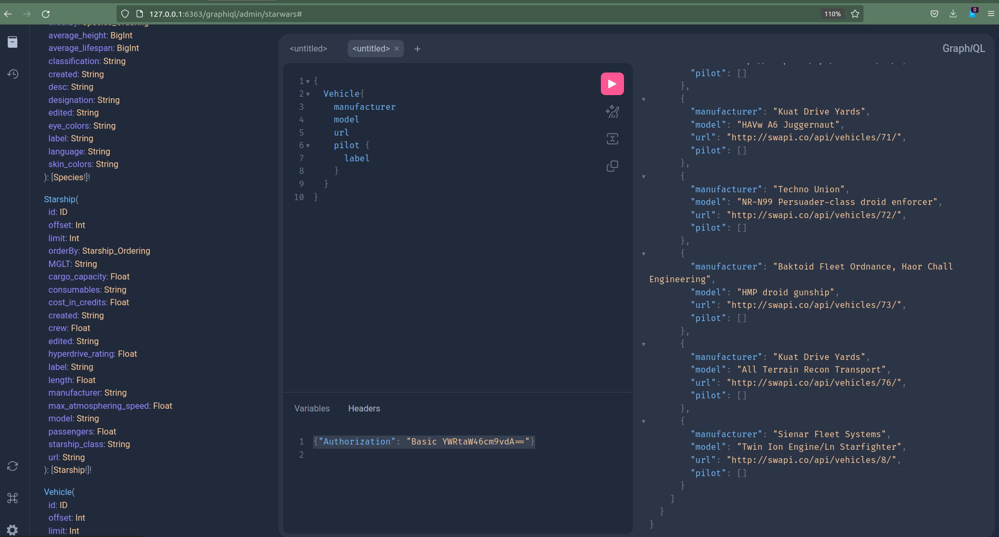

# StarWars in TerminusDB

Since TerminusDB recently got GraphQL, I thought I'd do the done thing
and load in the Star Wars Datset.

First, I looked around to find some JSON files that I could marshall
into TerminusDB without too much trouble, but as I was looking I came
across this DataSet: [Star Wars
Dataset](https://github.com/fgeorges/star-wars-dataset). This not only
has JSON files, but RDF!

I thought I'd take a crack at inserting RDF into TerminusDB and then
querying it with GraphQL to see what was required.

## RDF To TerminusDB

TerminusDB can read RDF files with little difficulty. However, to get
the value of TerminusDB you really need a schema. So first stop is
really trying to figure out what we might need to massage about the
RDF to get it into an easily schemable form.

The [original starwars ttl](../assets/star-wars-dataset.ttl) is
actually directly useable, but I don't particularly like when the
schema, and the data share the same namespace. For instance, here we
have `sw` used for both people, and the type of people.

```ttl
@prefix rdfs: <http://www.w3.org/2000/01/rdf-schema#> .
@prefix sw:   <http://h2o.consulting/ns/star-wars#> .
@prefix xs:   <http://www.w3.org/2001/XMLSchema#> .

sw:people-1  a  sw:People .
sw:people-1  rdfs:label  "Luke Skywalker" .
sw:people-1  sw:height  "172" .
sw:people-1  sw:mass  "77" .
...
```

To get rid of this, I decided to do a bit of sed scripting:

```shell
$ sed -ie 's/sw:\([A-Z]\)/schema:\1/' star-wars-dataset.ttl
$ sed -ie 's/ sw:\([^ ]*\) / schema:\1 /' star-wars-dataset.ttl
$ sed -ie 's/rdfs:label/schema:label'
```

This replaces all properties and all types using `sw:` to use
`schema:`, and remove `rdfs:label`, and replace with a local name
which is just going to look much less ugly when we use GraphQL
(perhaps later we will allow local renaming of classes and properties
for use in GraphQL).

Then we just swap out the prefixes in the header to yield this [file](../assets/star-wars-terminusdb.ttl):

```ttl
@prefix rdfs: <terminusdb:///schema/star-wars#> .
@prefix sw:   <terminusdb:///star-wars/> .
@prefix schema:   <terminusdb:///schema/star-wars#> .
@prefix xs:   <http://www.w3.org/2001/XMLSchema#> .

sw:people-1  a  schema:People .
sw:people-1  rdfs:label  "Luke Skywalker" .
sw:people-1  schema:height  "172" .
sw:people-1  schema:mass  "77" .
...
```

That's all there is to it!

Now we can load it into terminusdb from the command line. First we
create the database, with schema checking turned off.

```sh
$ terminusdb db create admin/star-wars --schema=false
```

Now we can load the turtle:

```sh
$ terminsudb triples load terminusdb triples load admin/starwars/local/branch/main/instance star-wars-terminusdb.ttl
```

Presto! We've got a Star Wars Database!

## Making the Schema

Now it is possible to query the database with TerminusDB using
WOQL. You can do this in the dashboard query panel, perhaps by using the query:

```javascript
let [a, b, c] = vars("a", "b", "c")
limit(10,triple(a,b,c))
```

However, TerminusDB is much more useable when you give it a bit of a
schema first.

We can open up the [file](../assets/star-wars-terminusdb.ttl) again
which will guide us in creating a schema. We'll open a file called
`star-wars.json` and start typing:

```json
[
    { "@type" : "@context",
      "@base" : "terminusdb:///star-wars/",
      "@schema" : "terminusdb:///schema/star-wars#"
    }
]
```

This first bit is the context. It will tell us what instance and
schema namespaces we have.

Next thing is to look at our ttl and see what kinds of things are
defined:

```ttl
sw:people-1  a  schema:People .
sw:people-1  rdfs:label  "Luke Skywalker" .
sw:people-1  schema:height  "172" .
sw:people-1  schema:mass  "77" .
sw:people-1  schema:hair_color  "blond" .
sw:people-1  schema:skin_color  "fair" .
sw:people-1  schema:eye_color  "blue" .
sw:people-1  schema:birth_year  "19BBY" .
sw:people-1  schema:gender  "male" .
sw:people-1  schema:homeworld  sw:planet-1 .
sw:people-1  schema:film  sw:film-6 .
sw:people-1  schema:film  sw:film-3 .
...
```

This has a bunch of properties that we should add to our
`star-wars.json` schema, just below the context, to define
`schema:People`. Since we have stated in our context that the base for
`@schema` matches the `schema:` prefix, we don't need to specify it
anymore in our objects.

This will look as follows:

```json
    ...
    { "@type" : "Class",
      "@id" : "People",
      "name" : "xsd:string",
      "height" : "xsd:decimal",
      "mass" : "xsd:decimal",
      "hair_color" : "xsd:string",
      "skin_color" : "xsd:string",
      "eye_color" : "xsd:string",
      "birth_year" : "xsd:string",
      "gender" : "xsd:string",
      "homeworld" : "Planet",
      "film" : { "@type" : "Set", "@class" : "Film" },
      "species" : {"@type" : "Optional", "@class" : "Species"},
      "starship" : {"@type" : "Set", "@class" : "Starship"},
      "vehicle" : {"@type" : "Set", "@class" : "Vehicle"},
      "url" : {"@type" : "Optional", "@class" : "xsd:anyURI"},
      "label" : { "@type" : "Optional", "@class" : "xsd:string"}
    },
    ...
```

Here we have a number of required properties, together with a number
of `Set` properties. Sets can have any number of elements of the
range. In addition we have a couple of `Optional` properties. These
can be anything. The datatypes we use are from
[xsd](https://www.w3.org/TR/xmlschema-2/), which lines up perfectly
with the RDF we have imported.

I repeated this process for `Film`, `Planet`, etc. until I got what I
felt was a [complete TerminusDB Star Wars schema](../assets/star-wars.json).

When I did the development, I'd add the classes, and properties I
thought I needed, and then I'd load the schema and have a browse in
the UI.

So:

```shell
$ terminusdb doc insert admin/starwars -g schema -f < star-wars.json
Documents inserted:
 1: People
 2: Film
 3: Planet
 4: Species
 5: Starship
 6: Vehicle
```

Then will see something like:



Then when I thought I was completely done, I'd do this:

```shell
$ terminusdb db update admin/starwars --schema=true
```

If there are any problems with the schema, this results in an error which will look something like:

```json
{
  "@type":"api:TriplesErrorResponse",
  "api:error": {
    "@type":"api:SchemaValidationError",
    "api:witness": {
      "@type":"unknown_property_for_type",
      "property":"terminusdb:///schema/star-wars#pilot",
      "type":"terminusdb:///schema/star-wars#Vehicle"
    }
  },
  "api:message":"Schema did not validate after this update",
  "api:status":"api:failure"
}
```

This is telling us that we are still missing a `pilot` property for
`Vehicle`. I missed about 10 or 15 properties in total and then I was done!

I had to modify some brokenness in the `ttl` file too, since some
properties were mispelled, and some had ranges which were
inconvenient, mixing strings and integers for instance. But after
reloading the triples I was able to do:

```shell
$ terminusdb update db admin/starwars --schema=true
Database updated: admin/starwars
```

Now you can fully utilize the document interface in TerminusDB. You
can browse through the People, Planets, Vehicles etc from the UI.

## Search using GraphQL

But we also now get the GraphQL interface. In the `graphql_endpoint`
experimental branch in TerminusDB (you can get this using the
bootstrap by specifying `graphql` in your config) you can navigate to
the following address:

```
http://127.0.0.1/graphiql/admin/starwars
```

You will then have to set the headers for your authorization. I use
the default locally:

```json
{"Authorization": "Basic YWRtaW46cm9vdA=="}
```

You will get a GraphQL user interface for the StarWars data set! This
is fully introspective and explorable, with a schema which is
autogenerated. You can browse through the classes on the left, and use
`C-c C-c` to get auto-completion.

It should look something like this:



Here you can enter in a query, such as:

```graphql
{
  Vehicle{
    manufacturer
    model
    url
    pilot {
      label
    }
  }
}
```

This will get you all of the Vehicles, together with some associated
specs, together with all of the pilots who drove them in the Star Wars
films.

We can also get some rudimetry search. For instance, we can ask for
the vehicles in order, taking only 3 of them, sorting by manufacturer.

```graphql
{
  Vehicle(limit:3, orderBy: { manufacturer : ASC }){
    manufacturer
    model
    url
    pilot {
      label
    }
  }
}
```

This results with:

```json
{
  "data": {
    "Vehicle": [
      {
        "manufacturer": null,
        "model": "Fire suppression speeder",
        "url": "http://swapi.co/api/vehicles/62/",
        "pilot": []
      },
      {
        "manufacturer": "Appazanna Engineering Works",
        "model": "Oevvaor jet catamaran",
        "url": "http://swapi.co/api/vehicles/69/",
        "pilot": []
      },
      {
        "manufacturer": "Appazanna Engineering Works",
        "model": "Raddaugh Gnasp fluttercraft",
        "url": "http://swapi.co/api/vehicles/70/",
        "pilot": []
      }
    ]
  }
}
```

Note: `null` is less than any value.

We can also page these results by setting an offset:

```graphql
{
  Vehicle(limit:3, offset: 3, orderBy: { manufacturer : ASC }){
    manufacturer
    model
    url
    pilot {
      label
    }
  }
}
```

And we get the next three...

```json
{
  "data": {
    "Vehicle": [
      {
        "manufacturer": "Aratech Repulsor Company",
        "model": "74-Z speeder bike",
        "url": "http://swapi.co/api/vehicles/30/",
        "pilot": [
          {
            "label": "Luke Skywalker"
          },
          {
            "label": "Leia Organa"
          }
        ]
      },
      {
        "manufacturer": "Baktoid Armor Workshop",
        "model": "Multi-Troop Transport",
        "url": "http://swapi.co/api/vehicles/34/",
        "pilot": []
      },
      {
        "manufacturer": "Baktoid Armor Workshop",
        "model": "Armoured Assault Tank",
        "url": "http://swapi.co/api/vehicles/35/",
        "pilot": []
      }
    ]
  }
}
```

You can likewise filter on the individual data fields. For instance,
we can write:

```graphql
{
  Vehicle(manufacturer: "Aratech Repulsor Company"){
    manufacturer
    model
    url
    pilot {
      label
    }
  }
}
```

And we will just get the "74-Z speeder bike"

```json
{
  "data": {
    "Vehicle": [
      {
        "manufacturer": "Aratech Repulsor Company",
        "model": "74-Z speeder bike",
        "url": "http://swapi.co/api/vehicles/30/",
        "pilot": [
          {
            "label": "Luke Skywalker"
          },
          {
            "label": "Leia Organa"
          }
        ]
      },
    ]
  }
}
```

One can poke around and see what queries are possible just by browsing
the interface.

## Next Steps

We're not done with the GraphQL schema generation yet. We're keen to
get back-links, which make it easy to follow arrows in reverse, path
queries, and then complex filtering and full text search. However it's
already possible to do quite a lot!

We're keen to see other example RDF datasets loaded and querable in
GraphQL with TerminusDB, so if you've anything in mind, drop us a line
at our [Discord](https://discord.com/invite/Gvdqw97)!
