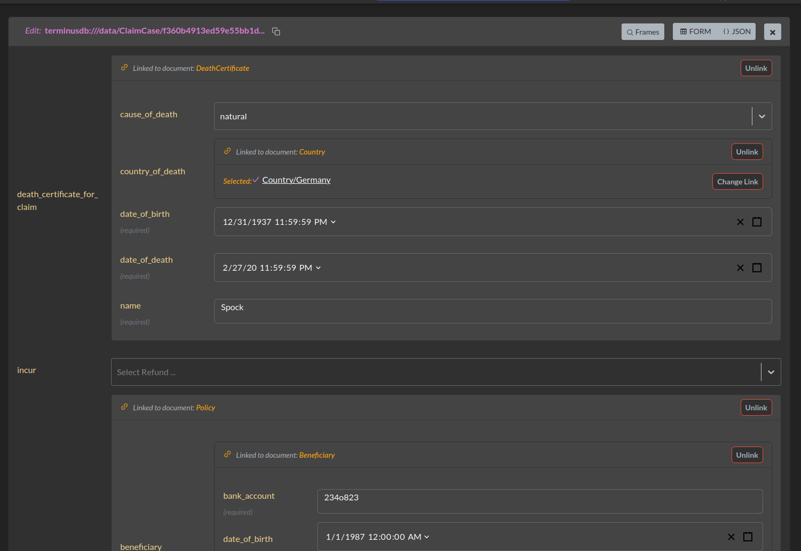
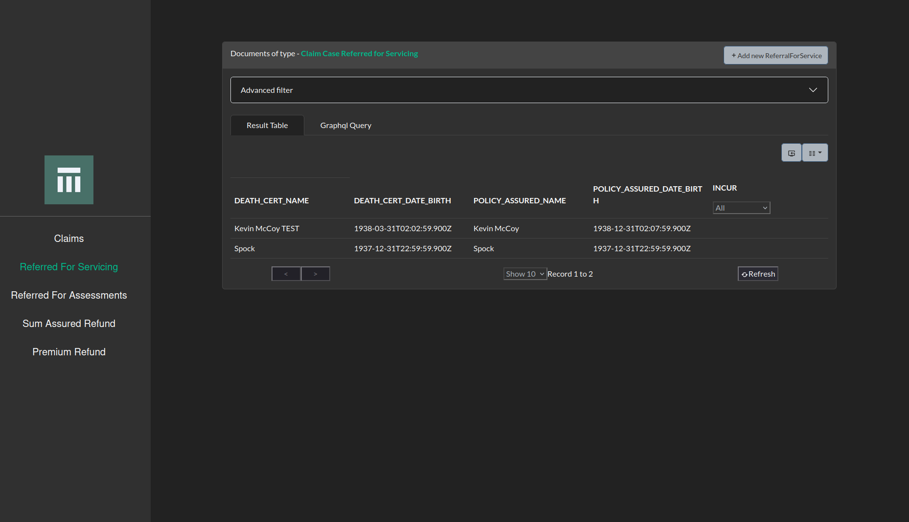
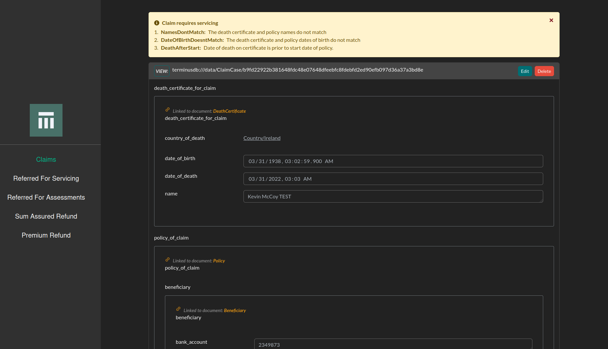

# Straight Through Processing of Insurance Claims

Can you build an app for straight through processing of insurance
claims, including UI for necessary human interventions in a week?

The answer, surprisingly is: Yes.

Of course with software [it's very hard to tell how long code takes
unless you
try](https://bigthink.com/neuropsych/task-completion-study). So we
built one. The secret to our success was two fold:

* We had a semantic description of our domain, making building of the
  UI almost completely automatic, and enabling logical description of
  the entities
* We used a declarative logical description of states of the insurance
  claim

So both the core logic of transitioning an insurance policy through
states, and the UI fell out of careful modeling of the problem
domain. This is what declarative software design is *supposed* to do
for us, and it worked so well that it even surprised me!

Best of all, it's very easy to customise, because it is a very low
code application, with most of the logic in the description. I expect
this approach can be used in a lot of FinTech applications and would
love to have the opportunity to try.

## Demo App

Of course our app doesn't do everything that you might want in a fully
fledged insurance claims application. We focused only on one use case:
life insurance policies.

However, it does do a surprising amount considering the time it took
to put together, and with a bit of elbow grease it seems to me it
could easily be a product in itself, and it could easily be grown out
to deal with a much larger assortment of claims.

## Modelling Insurance Claims

The first port of call is to model the *objects of interest* in claims
processing. This is the semantic part which is going to drive the rest
of the application.

Our demo app has the following elements:

* Countries
* Claim Cases
* Policies
* Beneficiaries
* Death Ceterificates

It also has a couple of enumerated types:

* Refunds (Sum Assured, Premium or Denied)
* Cause of Death (Natural, Manslaughter, Murder, Accidental and
  Suicide)

The entire [Claim case model can be seen here](../assets/claims.json)

Right out of the box, with this in place, we can get a default UI which looks
like this:



This is what TerminusCMS gives us with just a modelling of our
application domain. A nearly fully functional UI, which can then be
customised quickly by passing Javascript configuration objects in React.

## Adding Declarative States

To make our straight-through processing system, we model our *states*
as results of the *information content* of the objects themselves,
rather than some state variable which might not reflect the actual
qualities of the object.

Let us take a concrete example:

```javascript
{ "@comment": "Claim is eligible for a premium refund",
  "@given": [
      { "death_certificate_for_claim": {
          "date_of_death": {
              "@var": "DateOfDeath"
          }
      },
        "policy_of_claim": {
            "moratorium_end": {
                "@var": "MoratoriumEnd"
            },
            "moratorium_start": {
                "@var": "MoratoriumStart"
            }
        }
      }
  ],
  "@has": {
      "@ge": {
          "@var": "MoratoriumStart"
      },
      "@le": {
          "@var": "MoratoriumEnd"
      },
      "@with": "DateOfDeath"
  },
  "@noneOf": [
      "ReferralForAssessment",
      "ReferralForService",
      "ClaimClosed"
  ],
  "@on": "ClaimCase",
  "_id": "PremiumRefund",
  "_type": "Restriction"
}
```

What we are doing here is defining what claims are immediately
eligable for a premium refund. The conditions which place a claim in
this state are described declaratively. This is a business logical
description which helps us move to the appropriate state *automatically*.

First, we must check to find the death date associated with the claims
case, then we look for the start and end of the moratorium written
into the policy.

Next we check a condition, is the date of death between the start of
the moratorium, and the end? If so, the person is only eligable for
the refund of premiums made to date, and can not avail of the sum
assured.

In addition however, we have to check that the status of the record is
*safe* in the sense that all necessary associated information has
matched the conditions which would place it into a *referral for
assessment* or *referral for service*. These are conditions such as an
unusual cause of death (perhaps murder), or failure for death
certificate to match etc.

All of these other conditions are likewise written declaratively (as
you can see from the above schema).

We also want to exclude those records for which the claim has already
been closed (either due to a prior payout, or rejection).

## Actions and the UI

With these definitions which incorporate the relevant business logic,
we can turn it into a full fledged application. We build react
components automatically, and expose a rich GraphQL interface which
allows you to pull objects which meet a given *restriction* status
easily.

If a premium payout status is reached, for instance, then we can have
an *automated* procedure for payment, which then places the object in
a closed status if successful. In fact there may be many automatic
procedures that take place, each moving the object into a further
state which can ultimately result in closure of the claim case, or
movement into some human interaction.



If we are *referred for servicing* or some other state which requires
human intervention, we will appear in a dashboard automatically. This
dashboard only refers to the *state* of the object it would like to
retrieve, so all of the query logic is present entirely in the
model. This means that as business rules change, nothing needs to
change about the UI. It is only when new types of states are defined
that the UI must be altered, saving time and reducing complexity.



And when we reach this state we can tell the *reason* that we've ended
up in this state. This helps the human operator understand what needs
to be altered in order to place the claim in a new state no longer
requiring servicing.

## Conclusion

Declarative domain modelling is exceptionally powerful as a means of
writing *low code* applications.

And *low code* brings big benefits itself. It means easier
maintenance, faster development time and more flexible business
logic. This reduces costs of development and maintanence, and improves
agility, which is extremely important to respond to customer needs and
competitors.


