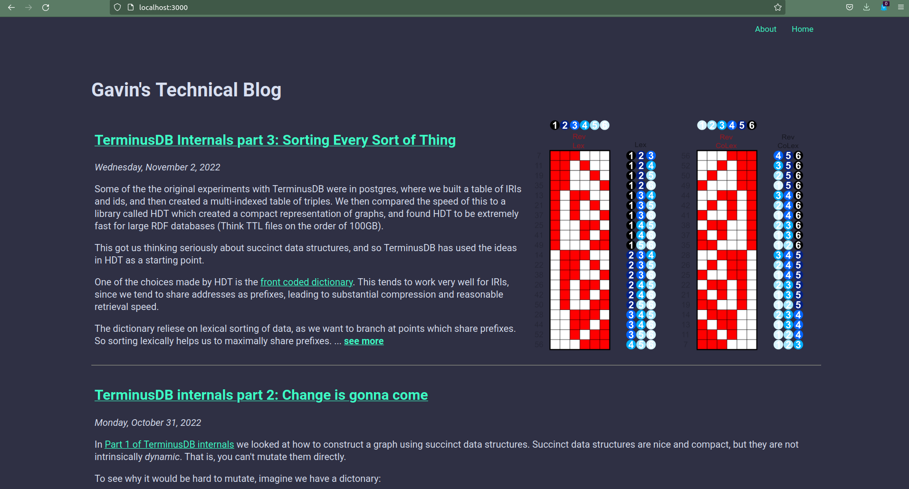

# A Blogging Platform in TerminusDB

How easy is it to make a blog-focused CMS in TerminusDB?

Very!

This
[terminusBlog](https://github.com/GavinMendelGleason/terminusBlog) is
designed to show how easy it is to build a custom web-app using
TerminusDB from scratch.

You should be able to clone the repository and run it locally provided
you have
[npm](https://docs.npmjs.com/downloading-and-installing-node-js-and-npm)
and [terminusdb](https://github.com/terminusdb/terminusdb) installed.

Just run:

```shell
make
npm start & terminusdb serve &
```

And you should be able to view the blog at `localhost:3000`. The
TerminusDB backend will be available at `localhost:6363`.

## The Schema

What do we want to store in a blog?  Typically we have: Authors, Posts, SiteMap,
and Pages. Let's start with those...

```javascript
{ "@type" : "Class",
  "@id" : "Author",
  "name" : "xsd:string",
  "avatar" : "xsd:anyURI"
  "bio" : "xsd:string" }
```

Our author is just a name, a bit of text describing who they are, and
a URI which we will use to display an image.

```javascript
{ "@type" : "Class",
  "@id" : "Post",
  "title" : "xsd:string",
  "content" : "xsd:string",
  "date" : "xsd:dateTime",
  "author" : { "@type" : "Set", "@class" : "Author" } }
```

Posts have a title, the actual content of the blog post, and a set of
possible authors (since sometimes you have more than one person
writing a piece) and when it was made.

```
{ "@type" : "Class",
  "@id" : "Page",
  "title" : "xsd:string",
  "content" : "xsd:string" }
```

Not much to a page! Just a timeless post.

```javascript
{ "@type" : "Class",
  "@id" : "SiteMap",
  "items" : { "@type" : "Set", "@class" : "SiteItem" }}

{ "@type" : "Class",
  "@id" : "SiteItem",
  "name" : "xsd:string",
  "location" : "xsd:anyURI" }
```

And a site map is just a set of items, with a name and location.

We can put all of this in a file, [schema.json](schema.json) and then (assuming we've already installed TerminusDB) load it with the command:

```shell
terminusdb store init
terminusdb db create admin/blog
terminusdb doc insert admin/blog -g schema -f < schema.json
```

Terminus will respond with:

```shell
Documents inserted:
 1: Author
 2: Post
 3: Page
 4: SiteMap
 5: SiteItem
```

## Layout

Now we want to actually design our website. First, let's create a
basic structure.

Assuming you have [npm](https://docs.npmjs.com/downloading-and-installing-node-js-and-npm) installed, you can run the following to start a react app.

```shell
npx create-react-app blog
```

I would also like to use GraphQL, so I'll install the Apollo client.

```shell
npm install @apollo/client
```

And since I hate writing HTML, and write all of my blogs in Markdown,
I'm going to use a Markdown renderer.

```shell
npm install react-markdown
npm install remark-gfm
npm install react-syntax-highlighter
npm install parse-numeric-range
```

React markdown is really great. It makes your source code look very
readable and deals with a wide variety of formats. To make it look
really beautiful however, I had to crib some tricks from [Amir
Ardalan's blog on
Markdown](https://amirardalan.com/blog/syntax-highlight-code-in-markdown).

Now we're basically ready to go, we just need to edit our [App.js](../assets/App.js) file
and give ourselves a river of news.

```jsx
function PostRiver() {
  const offsets = get_offsets()
  const { loading, error, data } = useQuery(POSTS_QUERY, {variables:offsets});
  if (loading) return <Loading />;
  if (error) return `Error! ${error.message}`;
  return (
    <div>
      <div name='post_river'>
      {data.Post.map((post) => {
          console.log(post)
          const date_time_obj = new Date(post.date);
          var options = { weekday: 'long', year: 'numeric', month: 'long', day: 'numeric' }
          var date_time = date_time_obj.toLocaleDateString("en-US", options)
          var id = post.id.replace(/^iri:\/\/data/, '')
          var path = `${id}`
          var content = snippit(post.content) + `... **[see more](${path})**`
          var image = post.feature ? Image(post.feature) : ''
          return (
           <div key={id} id={id} name='BlogCard'>
             <table className='blogTable'>
              <tr>
                <td className='blogData'>
                  <span><h2><a href={path}>{post.title}</a></h2></span><em>{date_time}</em>
                  <ReactMarkdown components={MarkdownComponents}>
                  {content}
                  </ReactMarkdown>
                </td>
                {image}
              </tr>
             </table>
             <hr />
          </div>
          )})}
      </div>
      <More />
    </div>
  );
}
```

Ok, so that has a lot in it.

The first bit, `get_offsets()` just graphs the current page if we're
not the home page, but have pressed the `more...` button.

We do a bit of date presentation stuff, some id munging, trimming of
the post to get a snippit, and then the actual blog synopsis card.

We do a GraphQL query to get the posts we are interested in, namely:

```graphql
 query PostsQuery($offset: Int, $limit: Int) {
    Post(offset: $offset, limit: $limit, orderBy: { date : DESC }) {
        id
        date
        title
        content
        feature {
           alt
           location
        }
    }
}
```

This gives us a feature image to go with our synopsis (if one exists).

## Router

We need to serve up a few pages, so its convenient to put in a router.

```shell
npm install react-router-dom
```

The main [App()](../assets/App.js) is pretty straight forward.

```js
function App() {
  let routes = useRoutes([
    { path: "/", element: <Posts /> },
    { path: "p", children : [
       { path: ":page", element: <Posts /> }]},
    { path: "Post", children : [
       { path: ":id", element: <SinglePost /> }]},
    { path: "Page", children : [
       { path: ":id", element: <SinglePage /> }]}
  ]);
  return routes;
}
```

We have the home page, further down the blog stream, a single post
display, and individual page display.

## The SiteMap

The SiteMap query gives back an ordered list of items which have a
name and a location. We use the `order` field, an int, to make sure we
get them back as an ordered list.

```graphql
query SitemapQuery {
    SiteMap {
        items(orderBy: { order : ASC }) {
           id
           name
           location
        }
    }
}
```

## Getting Some Data In

To get the data in, I just wrote a short python
[script](../assets/create_from_files.py) that grabbed my already
existing blogs.

Since the files are already Markdown, I just stick them in a content
field, extract a title and feature image using regexp magic and guess
a datetime from the unix timestamp of the file.

## Reflections

I never really used the Author object, as I'm the only Author, but
otherwise it's a fairly useable blogging engine as is.



I'm keen to put this up on TerminusX, and try to host the front end on
something like [Heroku](https://www.heroku.com/).

The whole thing demonstrates that TerminusDB makes a flexible GraphQL
backend for a content management system, with very little effort from
the developer.
